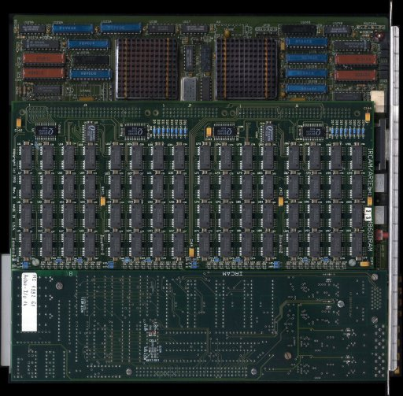
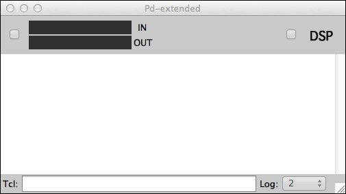
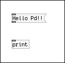

# ssaw130415

## Sound and Software art Workshop(SSAW13)について

Sound and Software Art Workshop(SSAW)は、火曜3〜4限の矢坂先生の授業と、月曜3〜4限の田所担当の授業で構成されています。授業の大きな目的は、ソフトウェアと自作のデバイスを用いて「楽器」を製作することです。

授業はおおまかに分けて、以下のような分担になっています。

* 楽器のための自作デバイスをArduinoでつくる (火曜)
* 楽器の音をソフトウェアで生成する (月曜)

月曜の各回の授業の内容は以下のWebページで公開していく予定です。

* [SSAW13月曜の授業のページ](http://yoppa.org/ssaw13)

### 授業のスケジュール

火曜日のワークショップは、以下のようなスケジュールを予定しています。

* 第１回：Pd入門1 – Pdとは? プログラミングの基本
* 第２回：Pd入門2 – 音響合成: シンセサイザーを作る
* 第３回：Pd入門3 – サンプリング＆プレイバック: サンプラー、リズムマシンを作る
* 第４回：PduinoをつかってPdとArduinoを連携する1
* 第５回：PduinoをつかってPdとArduinoを連携する2
* 第６回：最終課題制作に向けて
* 第７回：最終講評会

## Pure Data(Pd)とは?

このワークショップで主に使用するソフトウェアは、Pure Data(Pd)という開発環境です。

Pdは、1990年代に[Miller Puckette](http://crca.ucsd.edu/~msp/)氏とIRCAMの協力によって開発された、ビジュアルプログラミング言語です。Miller Pucketteによってプログラムのコアな部分はメンテナンスされているものの、現在ではオープンソース([PDライセンス](http://puredata.info/about/pdlicense)というBSDライセンスに似たライセンス)のプロジェクトとして公開されており、世界中の多くの開発者がその開発に携わっています。

Miller Puckette

### 参考サイト:

* [Pure Data — PD Community Site](http://puredata.info/)
* [Pure Data Japan](http://puredatajapan.info/)

## Pdの歴史、Pdの兄弟達

### Sogitec 4X

Pdの開発の歴史を辿っていくと、1980年代まで遡ります。当時はリアルタイムにソフトウェアで音響合成をするには、一般的なPCやワークステーションでは処理能力が追いつきませんでした。そのため、高価な音響合成のための専用のハードウェアをつかって、主に音響や電子音楽を研究する専門の施設で、ごく限られた研究者やアーティストによって使用されていました。

そうした専用ハードウェアの一つに、フランスのIRCAM(フランス国立音響音楽研究所 Institut de Recherche et Coordination Acoustique/Musique)で開発された、Sogitec 4Xがありました。当時IRCAMに在籍していたMiller Pucketteは、この4Xのコントロールのための専用言語として「Pucher」というエディターを開発しました。これが、Pdの祖先にあたります。

 

Sogitec 4X

### IRCAM Signal Processing Workstation (ISPW)

1989年、4Xは、NeXTコンピュータにIRCAM Signal Processing Workstation (ISPW)という専用ボードを積んだ状態のマシンに移植され「Max」と命名されました。これでIRCAM以外の施設でも使用できるようになったものの、ISPWボードはとても高価なもので、当時は限られた研究機関などでのみ使用できる状態でした。

 

IRCAM Signal Processing Workstation

### Maxの商用化 - Max/MSPへ

1989年、Maxは商用のアプリケーションとして、Opcode社にライセンスされます。当初の商用版のMaxはリアルタイムの音響合成をすることはできず主にMIDI情報を処理するためのビジュアルプログラミング言語として使用されていました。商用版のMaxのライセンスは、後にDavid Zicarelliが設立したCycling '74社に売却され現在も開発が継続しています。David Zicarelliは、MaxにMSPと呼ばれるリアルタイムの信号処理機能を加え、現在ではMax/MSPとして販売されています。

### Pdの誕生

David Zicarelliによる商用のMaxの開発とは別に、Miller Pucketteは完全に設計しなおしたフリーソフトとして、1996年Pure Data (Pd)をリリースします。Maxでは当初信号処理は専用のボード(ISPW)に依存していたのとは対照的に、Pdでは最初から信号処理など全ての計算はCPUで行なわれるよう設計されました。また、オープンソースとして公開されたため多くの環境に移植され、現在では、Mac OS X、Windows、Linux、iOS、Androidなど様々な環境で動作します。

## Pdの2つのバージョン

Pdのダウンロードページに行くと、2つのバージョンがあることに気付くと思います。この2つのバージョンは「Pd-vanilla」と「Pd-extended」と呼ばれて区別されています。

* [puredata.info > Downloads](http://puredata.info/downloads)

この2つのバージョンのPdは以下のような構成となっています。

* Pd-vanilla: 通常版Pd - Miller Puckette氏自身により開発が続けられている、音響合成のコアの部分のみのバージョン。
* Pd-extended: 拡張版Pd - 世界中の開発者によって開発されている、拡張版のPd。GUI、映像処理、物理演算、ハードウェアの制御など様々な機能が付加されている。

このワークショップでは、最終的にArduinoと接続して「楽器」の製作を目指します。ですので、必ず「Pd-extended」をインストールしてください。今後の解説も「Pd-extended」を前提に進めていきます。

## Pdの基本操作

### Pdを起動する

まずPd-extendedのアイコンをクリックして、Pdを起動してみましょう。プログラムの起動が完了すると、ウィンドウが表示されます。

このウィンドウは「Pdウィンドウ」と呼び、様々な情報を表示します。また音のon/offもこのウィンドウで行うことができます。

#### ピークメーター

ウィンドウの左上にあるトグルスイッチをonにすると入力と出力の音量がメーターで表示されます。このメーターで音量が振り切っていないか(クリッピング)を確認することが可能です。

#### DSPトグルスイッチ

画面右上のトグルスイッチで、音響処理のON/OFFを切り替えることが可能です。このトグルスイッチは、ショートカットキーでも切り替え可能です。

* ⌘ + / : ON
* ⌘ + . : OFF

#### コンソール

ウィンドウ下部の白い領域は「コンソール」と呼ばれ、プログラムのエラーメッセージを表示したり、プログラムの状態をモニターすることが可能です。またプログラムからメッセージを表示することなども可能です。

## 新規パッチの作成

メニューの「File」> 「New」もしくは、「⌘ + n」キーで新規のファイルを作成します。すると空白のウィンドウがひとつ表示されます。これはPdの空のプログラムです。Pdではこのウィンドウの中にプログラムを作成していきます。

Pdでは、プログラムのことを「パッチ(patch)」と呼ぶ習慣があります。これは、アナログシンセサイザーなどの時代にはプログラムすることはパッチケーブルというケーブルでシンセサイザーの各モジュールを接続することが「プログラム」だったことから派生しています。今後「パッチ」という言葉が出てきたらプログラムのことと理解してください。

## オブジェクトの配置、"Hello World"

Pdのプログラムは、このパッチの中に「オブジェクト」と呼ばれるプログラムの構成単位を配置することで行います。このオブジェクトを画面上でブロックのように組み上げていくことで、プログラムが作成されていきます。この操作が、例えばProcessingなどのようなテキストによるプログラミング環境との大きな違いとなります。

では、ひとつオブジェクトを配置してみましょう。オブジェクトの配置はメニューバーの「Put」以下にまとめられています。

新規に作成したパッチウィンドウを選択した状態で、「Put」> 「Object ⌘1」を選択してみましょう。画面に点線で囲まれた小さな四角形が表示されます。

次にこの点線の箱の中にカーソルをあわせ、「print」という文字を入力してみてください。入力し終えたら、ウィンドウ内の点線のボックス以外の領域を一度クリックします。すると点線だったボックスが実線に変化し、上に小さな接続口のようなものが表示されます。これでオブジェクトの配置は完了です。

次に別の種類のオブジェクトを追加してみましょう。「print」オブジェクトの上に、「Put」>「Message ⌘2」を選択してメッセージオブジェクトを追加します。メッセージオブジェクトを追加したら、中に任意のメッセージを入力します。例えば「Hello Pd!」と入力してみましょう。

最後にこの2つのオブジェクトを接続します。「Hello Pd」と入力したメッセージボックスの左下にある接続口にカーソルを近づけるとカーソルが「丸」になる瞬間があります。このタイミングでクリックします。するとボックスから線が伸びてきます。この線を「パッチケーブル」と呼んでいます。そのままドラッグして、今度は「print」を入力したオブジェクトの左上の接続口にマウスカーソルを重ねます。するとまたマウスカーソルが丸になる瞬間があるので、ここでマウスボタンを離します。すると、上下に「パッチケーブル」が接続されます。

この、「オブジェクトを配置」 → 「パッチケーブルを接続」という操作がPdでのプログラミングの基本です。

ではこのパッチをテストしてみましょう。Pdのパッチは編集しているモードのままでは動作しません。現在このパッチは「編集モード」にあります。これを動作させるには「Edit」→「Edit Mode」を選択してチェックを外すか、「⌘ + E」キーで編集モードを解除します。

編集モードを解除したら、「Hello Pd」のメッセージボックスをクリックしてみましょう。するとコンソールに「Hello Pd」のメッセージが表示されるはずです。

## もう少し複雑なパッチ、四則演算

## オブジェクトの種類

## 簡単なプログラムを作成してみる

## コンピューターで音を扱かうということ

## Sin波を出してみる

## Sin波のパラメータを変更

## 波形を変更してみる**

