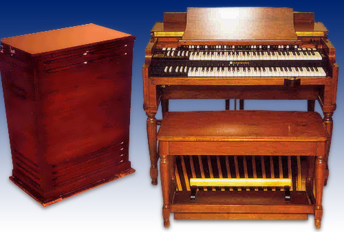
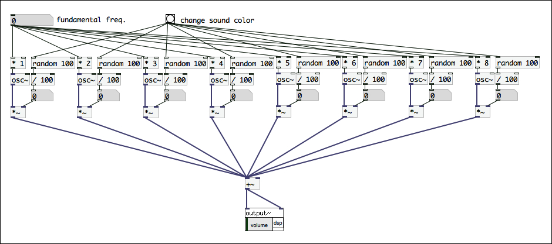
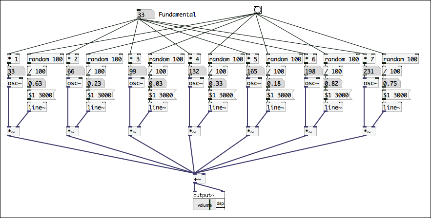
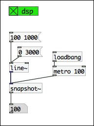
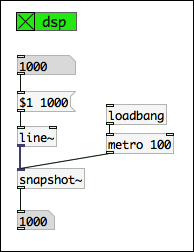
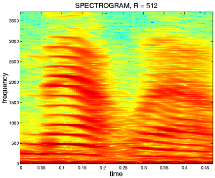
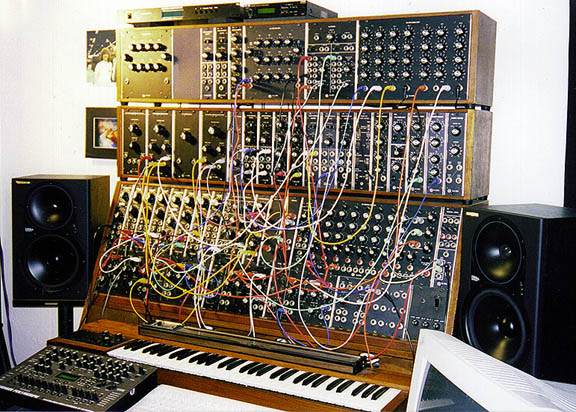

# 第2回: Pd入門2 – 音響合成、Pdでシンセサイザーをつくる

## 今日の内容

前回に引き続きPdの基本を学んでいきます。今回は「Pdでシンセサイザーをつくる」というテーマで進めていきます。

コンピューターが一般に普及する以前から、世の中には多くの電子楽器が存在し、その歴史は100年以上に及びます。そして、現在も進化を続けています。その歴史の中で、様々な音響合成(= 音色を合成する技術)が開発されてきました。

Pdは、音に関する汎用的なプログラミング環境なので、一つの音響合成の方式にとらわれることなく様々な音響合成を実際に音を聞きながら試していくことが可能です。このことで、音響合成に関する知識だけでなく、音や音色に関する理解も深まるのではないでしょうか。

### 参考: 世界最初の電子楽器「テレハーモニウム (Telharmonium)」

「テレハーモニウム」は、1897年サディウス・ケイヒル(Thaddeus Cahill)によって開発された、世界初の電子楽器です。重さ200トンにも及ぶ巨大なシステムで、電話網を通じて音楽を配信するという、その鑑賞方法も独特のものでした。

テレハーモニウムは、それより以前に存在していたオルガンを参考に、加算合成方式(後述)で音響合成していました。

* 動画: [Magic Music From The Telharmonium Documentary](http://www.youtube.com/watch?v=PPlbXl81Rs0)

## 音響合成1: 加算合成 (Additive synthesis)

「加算合成」とは、音の足し算による音響合成の手法です。

加算合成は「フーリエ級数展開」をその合成の論理的な基盤としています。フーリエ級数展開を簡単に説明すると「全ての周期的な波形は、基本周波数の整数倍のsin関数とcos関数の重ね合わせにより表現することができる」という定理です。この定理は、フランスの数学者ジョゼフ・フーリエによって熱伝導に関する研究の中で導入されました。

つまり、基本となる周波数の整数倍のオシレーターを無限(∞)に用意することができ、それぞれの音量を調整できるようにすれば、世の中の全ての周期的な波形を合成できるということを意味します。ただし、実際には無限の数のオシレータを用意することはできませんので、この理論を完全に再現することは困難です。

加算合成による音響合成の歴史は古く、オルガンに用いられている音響合成は加算合成を用いています。また前述したテレハーモニウムも加算合成によって音響合成していました。このオルガンの音響合成を電子的に再現した楽器には1934年にローレンス・ハモンドによって発明された「ハモンドオルガン」があります。

パイプオルガン

ハモンドオルガン

### Pdで加算合成 1 - 単純な加算合成

まず初めに、単純な加算合成を実現してみましょう。

100Hz、200Hz、300Hz、400Hz、500Hz、600Hz、700Hz、800Hzと100の整数倍のオシレータを8つ用意しています。また音量は倍音が高くなるにつれて少しずつ小さくなるように設定しています。最後にこれらを全て足し合わせて、output~に接続します。


実際に音を出してみると、オルガンのような音色が生成されます。単純ではありますが、加算合成が実現できました。

### Pdで加算合成 2 - 周波数を可変に

このままでは、常に同じ周波数しか鳴らすことができません。パッチに変更を加えて基本周波数(Fundamental Frequency)を変更できるようにしてみましょう。


### Pdで加算合成 3 - 様々な音色をランダムに生成

加算合成では、どのようにして音色が決定されるのでしょうか? それは、それぞれの倍音成分の音量です。

では、加算合成で様々な音色がランダムに生成されるようなパッチに変化させてみましょう。bangを受けとるたびに、0.0〜1.0までの数を生成するようにして、それぞれのオシレーターの音量にパッチしています。

bangボタンを何度も押して、音色の変化を聞き比べてみましょう。また基本周波数を変化させて、その違いも聞いてみましょう。

### Pdで加算合成 4 - 音色の変化をなめらかに

もうすこし工夫してみましょう。音色が一気に変化するのではなく、一定の時間をかけてなめらかに変化するようにしてみましょう。

ある値から別の値に一定のスピードで(線形に)値を変化させるには「line~」オブジェクトを使用します。「line~」の第１インレットには2つの数値をリスト(スペースで区切った複数の値の集合)として指定します。最初の値が変化する値の最終値、二番目の数値は変化に要する時間をミリ秒で指定します。

では、この例で用いられている、リストの先頭の「$1」は何でしょうか? 実は、$1は一番目のインレットから入力された数値を意味しています。この工夫によって、一定の時間で毎回違った値へ変化(補完)させることができているのです。

### 加算合成の限界

では、この加算合成の方式を応用して、リアルな楽器の音や、梵鐘の音など複雑な音響生成することは可能でしょうか? 現実の音響は、大量の倍音成分や、さらには整数倍ではない不協和な倍音の成分を含んでいます。さらにその倍音成分の音量は常に複雑に変化しており、耳はこれを詳細に聞き分けています。このことは、音のスペクトラム(周波数成分の変化)を観察してみると明かでしょう。

これを、加算合成で再現しようと思うとパラメーターの数が爆発的に増加してしまい、あまり効果的な方法とは言えません。

現実の音を模倣したり、複雑な倍音成分を持った音響を合成するという用途であれば、次回に紹介するサンプリングや分析-再合成といった手法を用いるべきでしょう。

スペクトラム

## 減算合成

減算合成 (Subtractive synthesis) とは、加算合成とは逆の音響合成のアプローチです。

加算合成を音の足し算とすると、減算合成は引き算で音響合成していきます。具体的には、まず沢山の倍音成分を含んだ音(ノイズ、ノコギリ波、矩形波)などを生成し、そこから一定の周波数成分だけを通過させる「フィルター」を使用して音色を変化させます。

フィルターには様々な種類が存在します。

* ハイパスフィルター (HPF): 高い周波数成分を取り出すフィルター
* ローパスフィルタ (LPF): 低い周波数成分を取り出すフィルター
* バンドパスフィルター (BPF): 特定の周波数成分を取り出すフィルター
* コムフィルター: ある周波数間隔おきの成分を通過させるフィルター
* マルチバンドフィルター: バンドパスフィルターが複数あるもの

減算合成による音響合成は、アナログシンセサイザーで広く用いられてきました。アナログシンセサイザーでは信号を加工する回路を以下のように呼んでいました。

* VCO: ボルテージコントロールドオシレータの略。基本波形を作る発振器。
* VCF: ボルテージコントロールドフィルターの略。波形を加工(フィルタリング)する回路。
* VCA: ボルテージコントロールドフィルターの略。波形を加工する回路。

これは、まさに減算合成による音響合成と言えます。

### Pdで減算合成 1 - ノイズをフィルタリング

