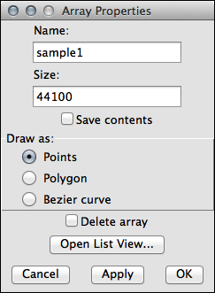

# 第3回: Pd入門3 – サンプリング&プレイバック

前回の「音響合成、Pdでシンセサイザーをつくる」では、加算合成、減算合成、変調合成といった様々な音響合成について解説しました。これらは、全く無の状態から音響を生成していくアプローチでした。今回はこれとは逆のアプローチで、具体的な音をコンピューターにとりこんで(サンプリング)、それを加工しながら再生(プレイバック)するという「サンプリング&プレイバック」というアプローチについて取り上げます。

## サンプリングとは

サンプリング(Sampling)は「標本化」と翻訳されます。その意味は、連続信号(アナログ信号)を一定の間隔をおいて測定することにより、離散信号(デジタル信号)として記録することです。直感的に理解すると、連続する波を数値の並びに変換するイメージです。

サンプリングするには、一定間隔でアナログ波形の値を測定する必要があります。この測定の時間間隔を「サンプリング周波数(Sampling rate)」と呼びます。サンプリング周波数は一般的にHzを単位にしてで記述します。例えばCDのサンプリング周波数は、44100Hz、つまり一秒間に44100個のサンプルを計測しています。DVDでは48000Hzでサンプリングしています。波形を正確に再構築するために信号帯域の2倍以上の速さでアナログ信号をサンプリングする必要があります。例えば、20000Hzまでを再現したい場合には、サンプリング周波数を40000Hz以上でサンプリング必要があります。この法則を「標本化定理(ナイキスト定理)」といいます。

また、信号をサンプリングする際に、信号の音量をどのくらいの細かさで計測するかという値を「量子化ビット数(Quantization bit rate)」と呼んでいます。量子化ビット数は、一般的に二進数の値、つまりビット(bit)で表現します。例えば量子化ビット数が8bitの場合には、表現できる細かさは、2の8乗、1024段階になります。16bitの場合は、2の16乗で65536段階となります。CDの量子化ビット数は16bit、DVDは24bitでサンプリングされています。

## サンプラー(Sampler)

パーソナルコンピューターの性能が現在のように発達していない頃は、サンプリングには「サンプラー」と呼ばれる専用のハードウェアを使用していました。サンプラーの歴史は比較的新しく、最初に一般に製品として販売されたサンプラーは、オーストラリアのフェアライト社が1979年に発表した「Fairlight CMI」です。当時の販売価格は1000万円以上するものでした。発売当初のサンプリング周波数は30.2kHz、量子化ビット数は8bitでした。1985年に発売されたシリーズIIIではサンプリング分解能を16ビット、サンプリング周波数を44.1kHzまで向上しました。その後、Synclavier、E-mu Systems、Akaiなど様々なメーカーからより安価なサンプラーが開発・販売され、音楽制作の現場で一般的に使用されるようになりました。

現在では、専用のハードウェアを用いることなくPC単体でサンプリングが可能となりました。こうしたPCベースのサンプラーは「ソフトウェア・サンプラー」と呼ばれます。Pdもソフトウェア・サンプラーとして使用することが可能です。さらに単に音を記録して再生するだけでなく、一度サンプリングした音を様々な加工変形して再生することが可能で、自由にプログラム可能なサンプラーとしてPdを捉えることもできるでしょう。

## Pdにサウンドファイルのデータをとりこむ

まずは、サウンドファイルから音のデータをPdにとりこんでみましょう。

Pdではサウンドデータを格納するためのデータ形式として、Arrayが用意されています。Arrayはその名前の通り「Array = 配列」として複数のデータ(リスト)を保持するだけでなく、その内容をグラフィカルに表示することも可能となっています。

まず始めに、新規にパッチを作成し、「配置」→「アレイ」を選びます。するとまず「アレイプロパティ」が表示されます。この各項目を設定します。

* 名前(name): Arrayの名前を入力します。この名前が後からパッチ本体から参照されます。
* サイズ(size): Arrayが格納できるデータの数。例えば、44100Hzのサンプリング周波数で1秒の音を格納するには、44100のサイズが必要となります。
* 描画方法(Draw as): グラフの描画方法です。
* Arrayの格納先(Put array into): 「新しいグラフ」を選択すると、パッチにArrayが生成されます。

それぞれの項目を下記の図のような設定にして、Arrayを配置しましょう。

Arrayにサウンドファイルのデータを読み込むには、「soundfiler」オブジェクトを使用します。soundfilerオブジェクトにサウンドーデータを読み込むには、第1インレットにメッセージを入力します。メッセージは以下のような内容となります。

* read -resize《ファイル名》《Arrayの名前》

例えば、「glitch_loop.aiff」という名前のサウンドファイルを「sample1」と名付けたArrayに格納したければ、下記のメッセージを入力します。

* read -resize glitch_loop.aiff sample1

では、ここまでの内容を実際にパッチを組んでみましょう。下記のようになるでしょう。

次にこの格納したサウンドファイルを再生してみます。Arrayに読み込んだサウンドデータは、「tabplay~」オブジェクトを使用して再生可能です。tabplay~オブジェクトの属性に、Arrayにつけた名前を指定します。例えば、Array「sample1」に格納したデータを再生したいのであれば、下記のように指定ます。

* tabplay~ sample1

では実際に先程のパッチに再生機能を付加しましょう。Bangを送るとサンプルが再生されます。

この「tabplay~」オブジェクトに数値のメッセージを入力すると、指定した値のサンプルから再生を始めます。また、2つの数値をリストにして入力すると、指定した数値の範囲を再生します。下記のようにパッチを改造して試してみましょう。

## サンプルデータを再生する

## サンプラーの工夫1

## サンプラーの工夫2

## グラニュラーシンセシス

