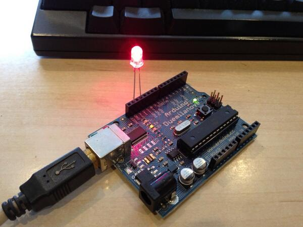
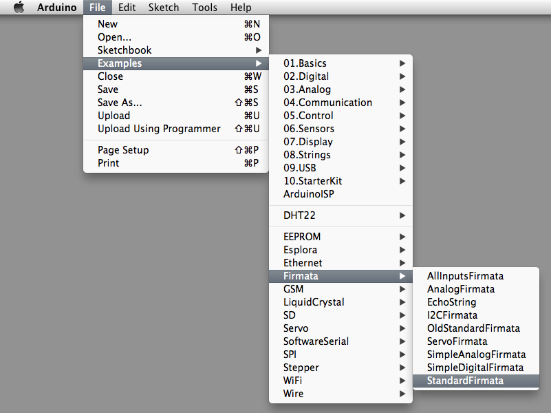
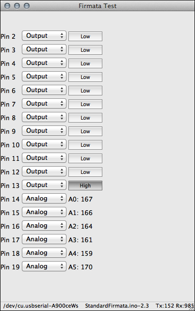
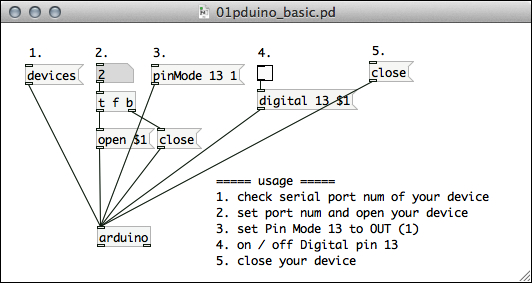

# 第3回: Pduinoをつかってみる - Pduinoによる、PdとArduinoの連携 1

## 今日の内容

今回からいよいよ火曜日のワークショップでとり扱かってきたArduinoと、この月曜のワークショップでやってきたPdを接続します。PdとArduinoで相互に通信ができるようにすることで、例えば曲げセンサーや加速度センサーを「楽器」のコントローラーとして使用したり、逆にPdで作成したパターンをLEDへにフィードバックさせたりといった相互の連携が可能となります。

PdとArduinoを連携するには「Pduino」という外部オブジェクトをダウンロードして使用します。

今回はまず、このPduinoを利用するための環境設定と動作確認を確実に行います。設定が完了したら、Pduinoを使用した簡単なパッチを作成し、実際にArduinoとの相互の連携を試してみましょう。

## 必要となるハードウェアとソフトウェア

今回必要となる機材は、以下の通りです。接続の方法やセットアップの方法は、手順を追って解説していきます。

### ハードウェア

* PC (Mac OS X、Windows、Linux) - このワークショップではMac OS Xでの使用を前提に解説します。
* Arduino、もしくはArduino互換の基盤
* LED
* 可変抵抗
* アナログセンサー - 照度センサー、温度センサーなど、まずは扱いが簡単なもので
* ArduinoとPCを接続するUSBドライブ

### ソフトウェア

* Pd-extended
* Arduino IDE
* Firmata
* Pduino


## Arduinoの設定確認

まずは、Arduinoの設定をします。Arduinoオフィシャルページの手順に従って、Arduinoの設定をしましょう。

* [Getting Started w/ Arduino on Mac OS X](http://arduino.cc/en/Guide/MacOSX)

この説明に従って、以下の順で進めていきます。

1. Arduino基盤とUSBケーブルを用意する
2. Arduino環境をダウンロード
3. ソフトウェアのインストール
4. 基盤を繋ぐ
5. Arduinoのアプリケーションを起動
6. 点滅のサンプルを開く
7. 基盤の種類を選択
8. シリアルポートを選択
9. プログラムをアップロード

#### Arduino実験用プログラム

```c++
int ledPin = 13;

void setup(){
  pinMode(ledPin, OUTPUT);
}
void loop(){
  digitalWrite(ledPin, HIGH);
  delay(1000);
  digitalWrite(ledPin, LOW);
  delay(1000);
}
```

無
事に13番Pinに繋いだLEDが点滅すれば準備完了です!



## Standard Firmataのインストール

ArduinoとPdの連携は以下のようにイメージしてください。


ここでは、ArduinoとPdが、2つの外部プログラムを通して相互に連携しています。

### Pd側
* Pduinoオブジェクトを使用したパッチを作成する
* OSCというプロトコルを介して、Arduinoへメッセージを送信

### Arduino側
* Firmataのプログラム(Standard Firmata)をArduino.appから基盤へアップロード
* Pduinoから送られてきたOSCを解釈
* ArduinoのAnalog IN、Digital ON/OFF をコントロール

## Arduino側の準備 - Firmataのインストール

では、まずArduino側から準備を始めましょう。

ArduinoにはFirmataと呼ばれる、ArduinoなどのマイコンとPCとのコミュニケーションのための汎用のプロトコルを使用します。そのために、ArduinoにFirmataのためのプログラムをアップロードして使用します。今回はArduinoのサンプルの中に掲載されている「Standard Firmata」というプログラムを使用していきます。

Arduinoのメニューから以下のプログラムを開きます。

* File > Examples > Firmata > StandardFirmata




このプログラムを、Arduinoに転送しましょう。これでArduino側の準備は完了です。今後Arduinoのプログラムを修正したり入れ替える必要はありません。

## Firmataの動作確認

Firmataの動作確認には、プロジェクトページから配布されているテストプログラムを使用します。

* [Main Page - Firmata](http://firmata.org/wiki/Main_Page)

このページの「Firmata Test Program」の項目にある

* For Mac OS-X: [http://www.pjrc.com/teensy/firmata_test/firmata_test.dmg](http://www.pjrc.com/teensy/firmata_test/firmata_test.dmg)

をダウンロードします。プログラムを展開し、FirmataをアップロードしたArduinoがUSBに接続されている状態で「firmata_test.app」を起動します。

プログラムのメニューバー「Port」メニューから接続しているポートを選択すると、下記のようなテスト画面になります。Pin 2 〜 Pin 21までの入出力をGUIで操作しながら試すことが可能です。



## Pduinoダウンロードと動作確認

次にPd側の準備をしましょう。

PdにはPduinoという拡張機能を使用します。下記のPduinoのプロジェクトページからダウンロードします。

* [http://at.or.at/hans/pd/objects.html](http://at.or.at/hans/pd/objects.html)

このページの中にある「Pduino-0.5.zip」をダウンロードします。Firmataは既に準備してあるので必要ありません。

まず手始めに、展開したフォルダの中にある「arduino-test.pd」を起動してみましょう。下記のように全てのオブジェクトが点線にならずに実体として表示されたら、きちんとPduinoが読み込まれています。


## Pduinoの使用手順

Pduinoを使用して、PdとArduinoを連携するには、いくつかの手順をふむ必要があります。下記のパッチはPduinoでArduinoへメッセージへ送るまでの手順を簡単に示したものです。このパッチを操作しながらPduinoの使用手順をみていきましょう。



### 1. デバイスのシリアルポートの番号を調べる

### 2. デバイス番号を指定してシリアルポートをオープン

### 3. Pin Modeの設定

### 4. メッセージ送信

### 5. シリアルポートを閉じる


## LEDを点滅させる


## PWMで、LEDの照度を調整


## 可変抵抗の値をPdで受信


## センサーを繋げてみる


## 音響合成への応用