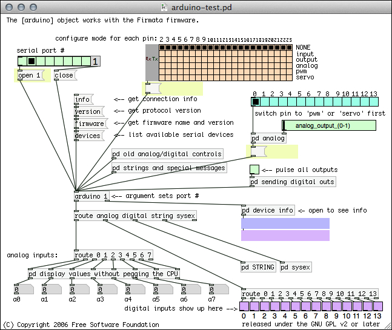
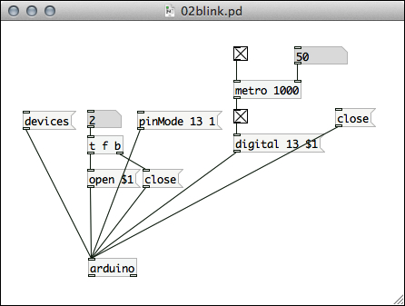
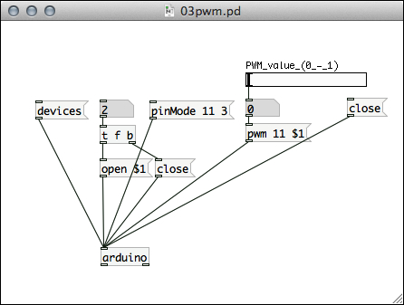
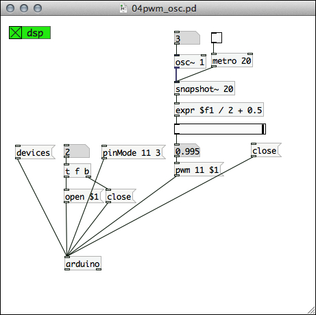

# 第3回: Pduinoをつかってみる - Pduinoによる、PdとArduinoの連携 1

## 今日の内容

今回からいよいよ火曜日のワークショップでとり扱かってきたArduinoと、この月曜のワークショップでやってきたPdを接続します。PdとArduinoで相互に通信ができるようにすることで、例えば曲げセンサーや加速度センサーを「楽器」のコントローラーとして使用したり、逆にPdで作成したパターンをLEDへにフィードバックさせたりといった相互の連携が可能となります。

PdとArduinoを連携するには「Pduino」という外部オブジェクトをダウンロードして使用します。

今回はまず、このPduinoを利用するための環境設定と動作確認を確実に行います。設定が完了したら、Pduinoを使用した簡単なパッチを作成し、実際にArduinoとの相互の連携を試してみましょう。

## 必要となるハードウェアとソフトウェア

今回必要となる機材は、以下の通りです。接続の方法やセットアップの方法は、手順を追って解説していきます。

### ハードウェア

* PC (Mac OS X、Windows、Linux) - このワークショップではMac OS Xでの使用を前提に解説します。
* Arduino、もしくはArduino互換の基盤
* LED
* 可変抵抗
* アナログセンサー - 照度センサー、温度センサーなど、まずは扱いが簡単なもので
* ArduinoとPCを接続するUSBドライブ

### ソフトウェア

* Pd-extended
* Arduino IDE
* Firmata
* Pduino


## Arduinoの設定確認

まずは、Arduinoの設定をします。Arduinoオフィシャルページの手順に従って、Arduinoの設定をしましょう。

* [Getting Started w/ Arduino on Mac OS X](http://arduino.cc/en/Guide/MacOSX)

この説明に従って、以下の順で進めていきます。

1. Arduino基盤とUSBケーブルを用意する
2. Arduino環境をダウンロード
3. ソフトウェアのインストール
4. 基盤を繋ぐ
5. Arduinoのアプリケーションを起動
6. 点滅のサンプルを開く
7. 基盤の種類を選択
8. シリアルポートを選択
9. プログラムをアップロード

#### Arduino実験用プログラム


```c++
int ledPin = 13;

void setup(){
  pinMode(ledPin, OUTPUT);
}
void loop(){
  digitalWrite(ledPin, HIGH);
  delay(1000);
  digitalWrite(ledPin, LOW);
  delay(1000);
}
```

無
事に13番Pinに繋いだLEDが点滅すれば準備完了です!


## Standard Firmataのインストール

ArduinoとPdの連携は以下のようにイメージしてください。


ここでは、ArduinoとPdが、2つの外部プログラムを通して相互に連携しています。

### Pd側
* Pduinoオブジェクトを使用したパッチを作成する
* OSCというプロトコルを介して、Arduinoへメッセージを送信

### Arduino側
* Firmataのプログラム(Standard Firmata)をArduino.appから基盤へアップロード
* Pduinoから送られてきたOSCを解釈
* ArduinoのAnalog IN、Digital ON/OFF をコントロール

## Arduino側の準備 - Firmataのインストール

では、まずArduino側から準備を始めましょう。

ArduinoにはFirmataと呼ばれる、ArduinoなどのマイコンとPCとのコミュニケーションのための汎用のプロトコルを使用します。そのために、ArduinoにFirmataのためのプログラムをアップロードして使用します。今回はArduinoのサンプルの中に掲載されている「Standard Firmata」というプログラムを使用していきます。

Arduinoのメニューから以下のプログラムを開きます。

* File > Examples > Firmata > StandardFirmata


このプログラムを、Arduinoに転送しましょう。これでArduino側の準備は完了です。今後Arduinoのプログラムを修正したり入れ替える必要はありません。

## Firmataの動作確認

Firmataの動作確認には、プロジェクトページから配布されているテストプログラムを使用します。

* [Main Page - Firmata](http://firmata.org/wiki/Main_Page)

このページの「Firmata Test Program」の項目にある

* For Mac OS-X: [http://www.pjrc.com/teensy/firmata_test/firmata_test.dmg](http://www.pjrc.com/teensy/firmata_test/firmata_test.dmg)

をダウンロードします。プログラムを展開し、FirmataをアップロードしたArduinoがUSBに接続されている状態で「firmata_test.app」を起動します。

プログラムのメニューバー「Port」メニューから接続しているポートを選択すると、下記のようなテスト画面になります。Pin 2 〜 Pin 21までの入出力をGUIで操作しながら試すことが可能です。


## Pduinoダウンロードと動作確認

次にPd側の準備をしましょう。

PdにはPduinoという拡張機能を使用します。下記のPduinoのプロジェクトページからダウンロードします。

* [http://at.or.at/hans/pd/objects.html](http://at.or.at/hans/pd/objects.html)

このページの中にある「Pduino-0.5.zip」をダウンロードします。Firmataは既に準備してあるので必要ありません。

まず手始めに、展開したフォルダの中にある「arduino-test.pd」を起動してみましょう。下記のように全てのオブジェクトが点線にならずに実体として表示されたら、きちんとPduinoが読み込まれています。




## Pduinoの使用手順

Pduinoを使用して、PdとArduinoを連携するには、いくつかの手順をふむ必要があります。下記のパッチはPduinoでArduinoへメッセージへ送るまでの手順を簡単に示したものです。このパッチを操作しながらPduinoの使用手順をみていきましょう。

まず、連携のためのメインのオブジェクトとなる「arduino」オブジェクトを配置します。このarduinoオブジェクトにメッセージを送ることで連携のための設定をしていきます。


### 1. デバイスのシリアルポートの番号を調べる

arduinoオブジェクトに「device」というメッセージ入力します。すると、Pdのコンソールに使用可能なシリアルポートの一覧とその番号が表示されます。例えば、以下のような形式になります。

```
[comport]: available serial ports:
	1	/dev/tty.Bluetooth-PDA-Sync
	2	/dev/tty.usbserial-A900ceWs
```

例えば、この場合は「/dev/tty.usbserial-A900ceWs」を使用するので、デバイス番号は「2」になります。

### 2. デバイス番号を指定してシリアルポートをオープン

次にこの取得したデバイス番号を利用して、シリアルポートをオープンします。「open 《番号》」というメッセージをarduinoオブジェクトに入力します。念のため、openする前に「close」メッセージを入力して確実にポートを閉じておくと良いでしょう。このパッチではcloseの入力とあわせて、openのポート番号を変更できるよう工夫しています。

### 3. Pin Modeの設定

Arduino IDEを使用する際と同様に、Arduinoの全ての入出力は、使用する前にPinModeを設定しなくてはいけません。arduinoに「pinMode 《ピンNo.》《モードNo.》」というメッセージを入力することで設定します。モード以下のように決められています。

※ 設定するピンNo.が10番だった場合

* pinMode 10 0 (pinMode 10 input) - Digital In : タクトスイッチなど
* pinMode 10 1 (pinMode 10 output) - Digital Out : LEDの点灯など
* pinMode 10 2 (pinMode 10 analog) - Analog In : 各種センサーの値の入力
* pinMode 10 3 (pinMode 10 pwm) - PWM : PWD(LEDの明度調整)
* pinMode 10 4 (pinMode 10 servo) - Servo : サーボモーターのコントロール


### 4. 値の送受信

シリアルポートとPinModeの設定が完了したら、いよいよ値を送受信します。このパートは送受信する内容(Digital/Analog)(Input/Output/PWM/Servo)によってやり方が異る部分ですので、以下のセクションで順番に解説していきます。

### 5. シリアルポートを閉じる

終了する際には、最後にシリアルポートを閉じて他のプログラムからも使えるようデバイスを開放します。「close」メッセージを入力すると、シリアルポートが閉じられます。


## LEDを点滅させる



## PWMで、LEDの照度を調整





## 可変抵抗の値をPdで受信


## センサーを繋げてみる


## 音響合成への応用